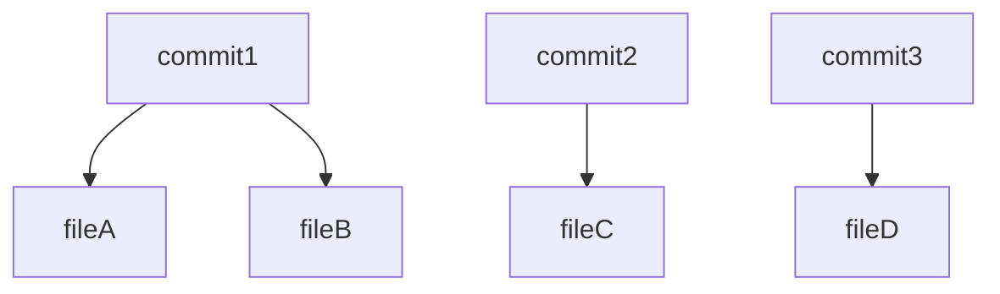

# Git Commit Dependency Graph Generator

Этот скрипт предназначен для извлечения истории коммитов из репозитория Git и построения графа зависимостей между измененными файлами в разных коммитах. Он генерирует визуализацию в формате Mermaid, который можно использовать для построения диаграмм.

## Описание работы

1. **Чтение конфигурационного файла**  
   Скрипт использует JSON-конфигурацию для указания пути к репозиторию, тега, для которого нужно извлечь коммиты, и файла, в который будет сохранен сгенерированный граф.

2. **Извлечение истории коммитов**  
   Используется команда `git log`, чтобы получить историю коммитов начиная с указанного тега.

3. **Сравнение коммитов**  
   Для каждого коммита в истории скрипт определяет, какие файлы были изменены, с помощью команды `git diff`.

4. **Построение графа зависимостей**  
   На основе изменений файлов между последовательными коммитами создается граф, где каждый коммит зависит от измененных в нем файлов.

5. **Генерация графа Mermaid**  
   Полученные данные представляются в виде графа в формате Mermaid, который может быть визуализирован с помощью соответствующих инструментов.

6. **Сохранение в файл**  
   Сгенерированный граф сохраняется в указанный файл.

## Установка

Для запуска скрипта вам потребуется Python 3.x и установленный Git.

1. Клонируйте репозиторий или загрузите скрипт.
2. Убедитесь, что у вас установлен Git. Для этого выполните команду:
   ```bash
   git --version
   ```

3. Установите зависимости:
   Скрипт использует стандартные библиотеки Python, такие как `os`, `subprocess` и `json`, так что дополнительные зависимости не требуются.

## Структура конфигурационного файла

Конфигурационный файл должен быть в формате JSON и содержать следующие ключи:

- `repository_path`: Путь к локальному репозиторию Git.
- `tag_name`: Имя тега, с которого нужно начать извлечение истории коммитов.
- `output_file`: Путь к файлу, в который будет сохранен граф в формате Mermaid.

Пример конфигурационного файла `config.json`:

```json
{
  "repository_path": "/path/to/your/git/repository",
  "tag_name": "v1.0.0",
  "output_file": "graph.mmd"
}
```

## Запуск скрипта

1. Убедитесь, что ваш конфигурационный файл настроен правильно.
2. Запустите скрипт, передав путь к конфигурационному файлу:

   ```bash
   python script_name.py config.json
   ```

3. После выполнения скрипта, в указанном файле `output_file` будет сохранен граф в формате Mermaid. Вы можете визуализировать его с помощью различных инструментов, например, с помощью [Mermaid Live Editor](https://mermaid-js.github.io/mermaid-live-editor/).

## Пример

Выполнив скрипт с примером конфигурации, вы получите такой граф:



Где:
- `commit1`, `commit2`, `commit3` — это хеши коммитов.
- `fileA`, `fileB`, `fileC`, `fileD` — это файлы, измененные в соответствующих коммитах.

## Ошибки

- **FileNotFoundError** — если конфигурационный файл не найден.
- **JSONDecodeError** — если в конфигурационном файле присутствуют ошибки синтаксиса JSON.
- **Ошибка Git команды** — если не удается выполнить команду Git (например, неправильный путь к репозиторию).

## Важные замечания

- Репозиторий должен быть инициализирован с Git и содержать хотя бы один тег.
- Для корректного извлечения коммитов и изменений файлов необходимо, чтобы все файлы и теги в репозитории были синхронизированы и доступны.
